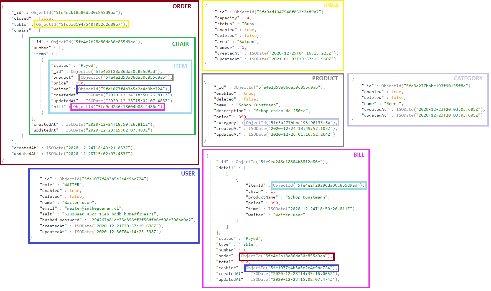

# In the guaren - API
   
API to manage orders by chair and table of the mythical restaurant 'In the Guaren' of the 'Jappening con Ja' show.

It can handle the orders placed by a table dividing the orders individually for each chair. You can ask for the bill to complete table as for each chair, without problems associated with separating accounts. 

### Installation
   
Firstly you must make sure you have [Node.js](https://nodejs.org/es/download/), [MongoDB](https://www.mongodb.com/try/download/community) and [Git](https://git-scm.com/downloads) installed on your system.

After that you must clone the repository.
```sh
$ git clone https://github.com/MauricioZepeda/In-the-Guaren-Backend.git 
```

At the end of the process, you must install the necessary dependencies to run the project.
  
```sh
$ cd In-the-Guaren-Backend
$ npm install  
```

If everything finishes without problems, you can run the project with the following instruction.

```sh
$ node app.js 
```
  
In the same way you can run it with [Nodemon](https://www.npmjs.com/package/nodemon) in the following way.
```sh
$ nodemon app.js 
```

### Documentation
 
To see the online documentation you should go to the following path. [http://localhost:5000/api-docs/](http://localhost:5000/api-docs/).
  
### Data sctructure

The structure of the data entered in the system would be the one shown in the image below



### User roles
 
There are 3 types of roles for users:

**ADMIN:** It is in charge of creating, editing and deleting: 
 - Tables
 - Categories
 - Products
 - User

**WAITER:** Its function consists mainly of: 
 - Add items for each chair
 - Confirm orders
 - Return ordered products
 - Ask the bill for:
    - The full table
    - Each chair individually
 - Reopen a closed table
   
**CASHIER:** It is in charge of: 
  - Register the payment of: 
    - Each chair
    - The full table 

### Postman 

Also all endpoints are included in [Postman](https://www.postman.com/downloads/) to facilitate testing. The file that you must import into the [Postman](https://www.postman.com/downloads/) application is at 'resources' folder and it is called.

```sh
/resources/In the Guaren - Backend.postman_collection.json
```

It also includes the following Postman variables that are updated when executing **SIGNIN** in postman app (they are updated automatically, except baseURL which is fixed).

These variables are **{{baseURL}}** **{{token}}** and **{{userID}}** 
And these are included in the following path that is found at the Postman folder and it is called.
 
```sh
/resources/Dev.postman_environment.json
```
**P.S: Likewise you can use postman without these variables by replacing the data manually**
 
**Finally: The .env file was uploaded to avoid problems with environment variables when cloning the project.**  
